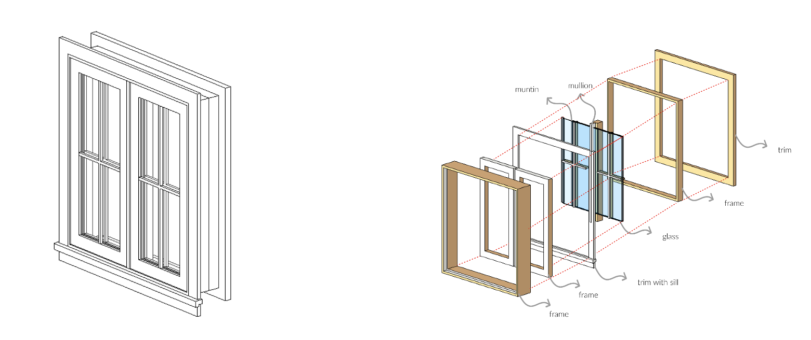
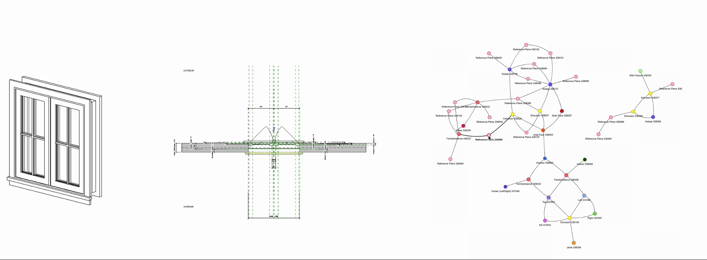
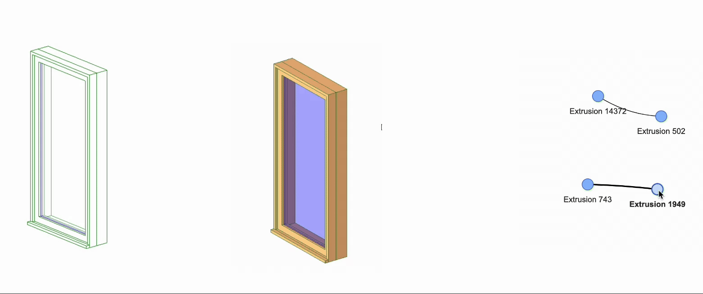
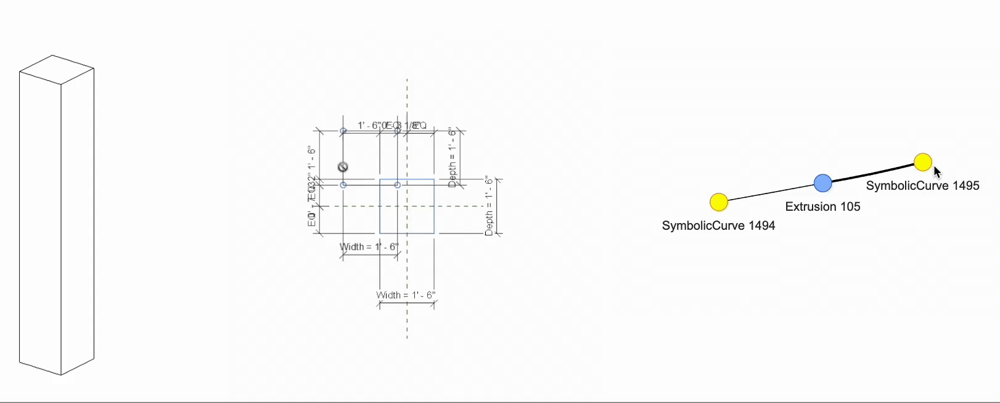
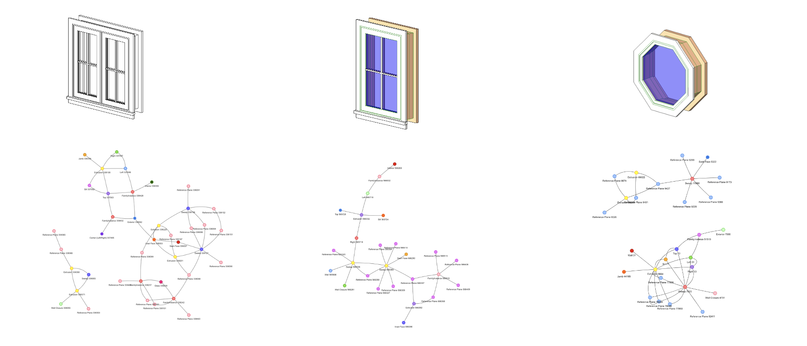
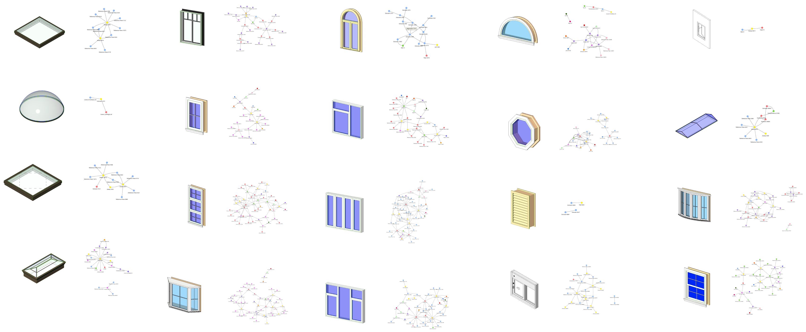

# Revit Assembly
This is a pipeline to generate a graph representation containing geometric and component level information from 3D Revit models.
The graph is a novel representation that contains information of a 3D model's semantic components the geometric relationship of their assembly. This pipline is used to create 3D model datasets with user-generated procedural information to support
ML-based systems for design data exchange on the cloud platform. The process involves querying geometric data and tabular information from Revit 3D models and outputing an interactive graph representation.

<figcaption style="font-size: 12px; color: gray;">Decomposing 3D models by their semantic components and mapping the geometric relationship of their assembly is complex.   We demonstate the pipeline with the simplist window model. </figcaption>

 
<figcaption style="font-size: 12px; color: gray;">Graph representation of a simple column and frame from the default Revit library.</figcaption>

## Installation
### Dependencies 
     - networkx
     - pprint
     - pyvis
     - json
     - os
     - sys
     - clr
### Revit plugin 
     - RevitPython
     - RevitLookup (for debugging)

## Workflow

1. **Run `_revit2text.py` in Revit**  
   - Use the RevitPython plugin.
   - For each component in the Revit family:
     - Attempt to move the component in the XYZ direction.
     - Trigger an error.
     - Extract relevant elements in JSON format.

2. **Run `_text2graph.py`**  
   - Create a `networkx` graph.
   - Visualize the graph using PyVis.

## Example dataset

 
 

Example dataset generated with this pipeline. Original Revit models are from Revit's basic library and https://www.bimobject.com/

